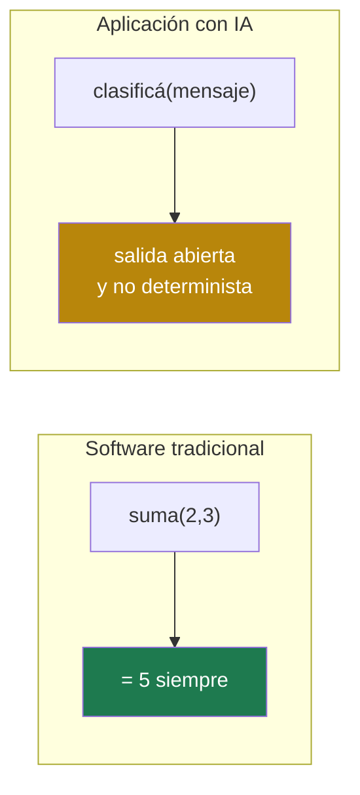
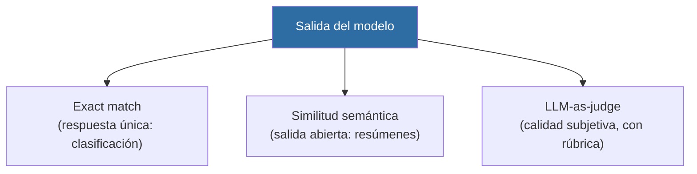
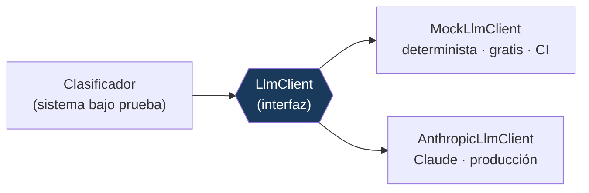

# Evals de Aplicaciones con IA — LLM Testing

Harness de **evaluación (evals)** para testear una aplicación basada en un modelo de lenguaje (LLM), un sistema **no determinista**. Construido con **TypeScript**, con un modelo mock determinista para el gate de CI y un adaptador real de **Claude** (Anthropic SDK) para correr contra producción.

---

## Resumen ejecutivo

| | |
|---|---|
| **Qué es** | Un marco para evaluar la calidad de un sistema con IA de forma sistemática, con datasets, métricas y umbrales — el equivalente de una suite de tests para software no determinista. |
| **Problema que resuelve** | Un LLM no se puede testear por igualdad exacta: la misma entrada puede dar salidas distintas y no hay "una" respuesta correcta. Se necesitan otras técnicas: golden datasets, scorers y umbrales. |
| **Enfoque** | Un sistema bajo prueba real (clasificador de tickets), un golden dataset, tres tipos de scorer, y un umbral que actúa como gate para detectar regresiones de prompt. |
| **Resultado** | Evaluación reproducible y gratuita en cada PR (modelo mock), con el camino a un proveedor real documentado y tipado. Detecta regresiones antes de producción. |
| **Stack** | TypeScript · Vitest · Anthropic SDK (Claude) |

---

## Por qué testear IA es distinto



`assertEquals(suma(2,3), 5)` es determinista. Pero pedirle a un LLM que clasifique un mensaje puede dar respuestas con distinto formato ("billing", "Billing.", "La categoría es billing"), y para tareas abiertas (resumir) no existe una única salida correcta. Por eso se evalúa con **propiedades y métricas**, no con igualdad.

---

## Las tres capas de scoring



| Scorer | Cuándo | Devuelve |
|---|---|---|
| **Exact match** | Hay una respuesta única correcta (clasificación) | 0 / 1 |
| **Similitud semántica** | Salida abierta sin una única forma correcta | 0..1 |
| **LLM-as-judge** | Calidad subjetiva (tono, completitud) contra una rúbrica | 0..1 |

---

## El umbral como gate (detección de regresiones de prompt)

Las evals **no exigen 100%**: se fija un umbral empírico. Si la exactitud cae por debajo, el gate falla. Así se detecta una **regresión de prompt** — un cambio que mejora un caso pero degrada la métrica global.

```
$ npm run evals

Evals del clasificador de tickets
  Casos       : 13
  Correctos   : 12
  Exactitud   : 92.3%
  Umbral (gate): 80%

  Casos fallidos:
    • "La factura mensual no se descarga desde la app"  esperado=technical obtenido=billing

✅ Gate OK: exactitud por encima del umbral.
```

El caso que falla tiene **señales mixtas** ("factura" + "no se descarga") — el tipo de caso de borde que los evals deben capturar. El gate pasa porque 92.3 % supera el umbral.

---

## Mock determinista vs proveedor real



El sistema depende de una **interfaz** `LlmClient`, no de un proveedor concreto. En CI se inyecta el **mock** (reproducible y gratis); para evaluar contra el modelo real se inyecta el adaptador de **Claude**, sin cambiar el clasificador ni las evals. Correr un modelo real en cada PR sería caro, lento y no determinista — por eso el gate usa el mock, y el proveedor real queda para corridas contra producción.

---

## Estructura

```
src/
├── llm/
│   ├── client.ts            # interfaz LlmClient
│   ├── mock-client.ts       # modelo mock determinista (CI)
│   └── anthropic-client.ts  # adaptador real de Claude (producción)
└── classifier.ts            # sistema bajo prueba (clasificador + parseo tolerante)
evals/
├── dataset.json             # golden dataset
├── scorers.ts               # exact-match, similitud, LLM-as-judge
├── config.ts                # umbral (gate)
└── run-evals.ts             # runner + gate
tests/                       # tests de scorers, clasificador y suite de evals
```

---

## Uso

```bash
npm install
npm test           # tests unitarios (scorers, clasificador, suite de evals)
npm run evals      # corre las evals con el mock y aplica el gate
npm run typecheck

# Para evaluar contra Claude real (requiere ANTHROPIC_API_KEY):
# inyectar AnthropicLlmClient en lugar de MockLlmClient.
```

---

## Documentación técnica

**[docs/DOCUMENTACION-TECNICA.md](docs/DOCUMENTACION-TECNICA.md)** detalla: por qué el testing de IA es distinto, el diseño del golden dataset, los tres scorers y cuándo usar cada uno, LLM-as-judge y sus riesgos, umbrales sobre métricas continuas, la regresión de prompts y la estrategia mock vs proveedor real.

---

## Contexto

Parte de una serie de proyectos de automatización de calidad orientados a perfiles QA Automation y SDET, con foco en el testing de sistemas de IA.

---

## Licencia

MIT.
